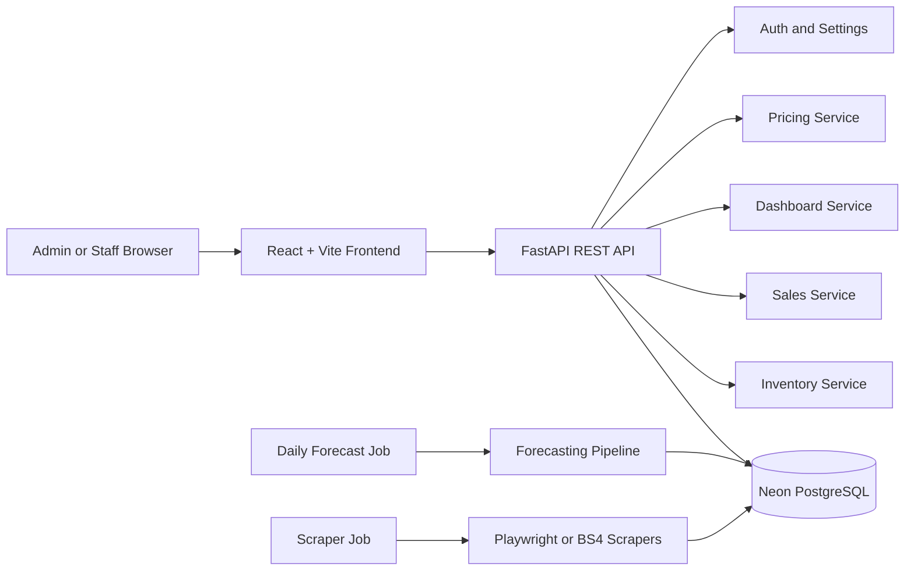

# Stock Sage Consultation Guide

Date: April 14, 2026

This guide is the team's consolidated reference for adviser consultation, panel questions, and defense preparation. It explains what Stock Sage is, what is already implemented, how the system works, what evidence supports it, and how to answer likely technical and thesis-scope questions.

## 1. Short Project Explanation

Stock Sage is a web-based inventory intelligence prototype for a computer parts store. It centralizes products, inventory balances, sales transactions, stock movement history, AI-assisted demand forecasting, reorder recommendations, competitor price comparison, and operational dashboards in one React and FastAPI application.

The project is built as a thesis-aligned prototype, not a full commercial SaaS product. Its main goal is to prove that a small store can move from manual inventory monitoring toward a data-driven system that supports stock planning and pricing decisions.

## 2. Consultation Positioning

Use this framing when asked what the system is:

> Stock Sage is a local-first web prototype for inventory monitoring and decision support. It records products, sales, and stock movement; runs scheduled forecasting jobs; generates reorder recommendations; compares competitor prices; and provides an admin-controlled dashboard for store staff.

Use this framing when asked what problem it solves:

> The system reduces manual checking by giving store operators a single dashboard for low-stock products, predicted stockout dates, inventory value, sales trend, forecast quality, and competitor price gaps.

Use this framing when asked what makes it AI-related:

> The AI component is the demand forecasting and recommendation pipeline. It uses historical sales data, model selection, backtesting, confidence scoring, and guardrails to estimate future SKU demand and support reorder decisions.

## 3. Current Scope

### In Scope

- Product and SKU management.
- Inventory balance tracking.
- Manual stock adjustment.
- Sales transaction recording.
- Stock movement history.
- Low-stock dashboard.
- Predicted stockout timeline.
- Reorder recommendation generation.
- Daily forecast job.
- Forecast metrics report.
- Competitor price scraping and price comparison.
- Scraper source quality report.
- Admin login and session-based authentication.
- Admin-only settings page.
- Staff and admin account creation.
- Audit logs for sensitive account actions.
- Local development and cloud database support using Neon PostgreSQL.

### Out of Scope or Deferred

- Native mobile application.
- Fully automated purchase order submission to suppliers.
- Payment processing.
- Barcode scanner integration.
- Automatic email/SMS low-stock notification delivery.
- Completed usability study results.
- Human override workflow for forecast recommendations.
- Production-grade enterprise RBAC beyond `admin` and `staff`.

When asked about these gaps, answer directly: they are identified extensions, not hidden missing parts of the current prototype.

## 4. User Roles

| Role | What They Can Do | What They Cannot Do |
|---|---|---|
| Admin | Access dashboard, inventory, transactions, settings, account management, audit logs | None within current prototype scope |
| Staff | Access dashboard, inventory, and transactions | Cannot access Settings, create users, deactivate users, or view audit logs |

Implementation reference:

- Backend role checks: [auth_service.py](../backend/app/services/auth_service.py)
- Settings API: [routes_settings.py](../backend/app/api/routes_settings.py)
- Frontend role gating: [App.tsx](../frontend/src/App.tsx)
- Settings UI: [SettingsPanel.tsx](../frontend/src/components/SettingsPanel.tsx)

## 5. Main Features

### Dashboard

The dashboard summarizes inventory operations and forecasting outputs:

- Inventory value.
- Low-stock item count.
- Out-of-stock count.
- Revenue today.
- Product count.
- Low-stock alerts.
- Predicted stockout timeline.
- Price comparison results.
- Scraper source quality.
- Forecast metrics report.
- Item-level forecast modal.

Primary files:

- [routes_dashboard.py](../backend/app/api/routes_dashboard.py)
- [dashboard_service.py](../backend/app/services/dashboard_service.py)
- [App.tsx](../frontend/src/App.tsx)

### Inventory

Inventory features support product creation, product editing, supplier association, current stock balance, and manual stock adjustment.

Primary files:

- [routes_inventory.py](../backend/app/api/routes_inventory.py)
- [inventory_service.py](../backend/app/services/inventory_service.py)
- [InventoryProductsTable.tsx](../frontend/src/components/InventoryProductsTable.tsx)

### Transactions

The transaction module records sales and updates inventory through stock movements. This creates the historical data needed by the forecasting pipeline.

Primary files:

- [routes_sales.py](../backend/app/api/routes_sales.py)
- [sales_service.py](../backend/app/services/sales_service.py)

### Forecasting

The forecasting pipeline estimates future daily demand per SKU and generates reorder recommendations. The system uses historical sales and inventory context, evaluates candidate models, applies quality checks, and stores forecast outputs in the database.

Key outputs:

- Forecast run records.
- SKU-level daily forecast values.
- Predicted stockout dates.
- Reorder points.
- Suggested reorder quantities.
- Confidence score.
- Forecast report metrics.

Primary files:

- [run_forecast_daily.py](../backend/app/jobs/run_forecast_daily.py)
- [predict.py](../backend/app/ml/predict.py)
- [model_registry.py](../backend/app/ml/model_registry.py)
- [reorder_service.py](../backend/app/services/reorder_service.py)

### Price Comparison

The scraper job collects competitor price snapshots from configured sources. The pricing service compares the store price against the latest competitor snapshots.

Primary files:

- [run_scraper_cycle.py](../backend/app/jobs/run_scraper_cycle.py)
- [playwright_scraper.py](../backend/app/scrapers/playwright_scraper.py)
- [bs4_scraper.py](../backend/app/scrapers/bs4_scraper.py)
- [pricing_service.py](../backend/app/services/pricing_service.py)

### Settings

The Settings page is admin-only and includes:

- System tab: authentication/account summary.
- Accounts tab: create admin or staff accounts, view account status, deactivate accounts.
- Audit Logs tab: view sensitive account actions.

Backup and recycle-bin features are intentionally not included in the current scope.

Primary files:

- [routes_settings.py](../backend/app/api/routes_settings.py)
- [SettingsPanel.tsx](../frontend/src/components/SettingsPanel.tsx)
- [0003_user_roles_audit_logs.py](../backend/alembic/versions/0003_user_roles_audit_logs.py)

## 6. Architecture Summary

Stock Sage uses a three-part architecture:

1. React frontend for dashboard, forms, tables, login, and settings.
2. FastAPI backend for REST endpoints, authentication, business logic, and scheduled jobs.
3. Neon PostgreSQL database for persistent products, sales, inventory, forecasts, competitor prices, users, and audit logs.



See the detailed architecture reference in [thesis-architecture-traceability.md](./thesis-architecture-traceability.md).

## 7. Data Flow

### Operational Data Flow

1. Admin or staff records products, stock adjustments, or sales.
2. Frontend sends REST requests to FastAPI.
3. Backend validates the request and writes to PostgreSQL.
4. Inventory balances and stock movements are updated.
5. Dashboard endpoints aggregate the latest operational state.

### Forecasting Data Flow

1. Forecast job reads sales history, stock movement history, product data, and lead-time context.
2. Feature builder prepares daily demand data.
3. Model selection compares forecasting candidates and baseline behavior.
4. Forecast output is stored in `forecast_runs` and `sku_forecasts`.
5. Reorder logic computes stockout date, reorder point, suggested quantity, and confidence.
6. Dashboard displays the forecast and recommendations.

### Price Comparison Data Flow

1. Scraper job reads active products and enabled competitor sources.
2. Scrapers search or fetch product pages.
3. Parser extracts candidate product name, price, and stock state.
4. Matched results are stored as competitor price snapshots.
5. Pricing endpoint compares store price with competitor price.
6. Dashboard displays price gaps.

## 8. Database Summary

| Area | Tables |
|---|---|
| Authentication and settings | `admin_users`, `audit_logs` |
| Inventory | `suppliers`, `products`, `inventory_balance`, `stock_movements` |
| Sales | `sales_transactions`, `sales_items` |
| Competitor pricing | `competitor_sources`, `competitor_price_snapshots` |
| Forecasting | `forecast_runs`, `sku_forecasts`, `reorder_recommendations` |

Detailed schema source: [models.py](../backend/app/db/models.py)

## 9. API Surface

Base local URL: `http://localhost:8000`

### Public or Session Endpoints

| Method | Endpoint | Purpose |
|---|---|---|
| GET | `/health` | Backend health check |
| GET | `/auth/me` | Current session status |
| POST | `/auth/login` | Login and issue session cookie |
| POST | `/auth/logout` | Clear session cookie |

### Protected Operational Endpoints

These require an authenticated admin or staff account.

| Method | Endpoint | Purpose |
|---|---|---|
| POST | `/suppliers` | Create supplier |
| POST | `/products` | Create product |
| GET | `/products` | List products |
| PATCH | `/products/{product_id}` | Update product |
| POST | `/inventory/adjust` | Adjust stock |
| POST | `/sales` | Record sale |
| GET | `/dashboard/low-stock` | Low-stock rows |
| GET | `/dashboard/sales-trend` | Sales trend |
| GET | `/dashboard/kpis` | Dashboard KPI summary |
| GET | `/dashboard/scraper-source-quality` | Scraper source health |
| GET | `/dashboard/stockout-dates` | Predicted stockout rows |
| GET | `/dashboard/forecast-report` | Forecast metrics report |
| GET | `/dashboard/forecast-report/compare` | Compare forecast runs |
| GET | `/dashboard/item-forecast/{product_id}` | Item forecast detail |
| GET | `/prices/compare` | Competitor price comparison |

### Admin-Only Settings Endpoints

| Method | Endpoint | Purpose |
|---|---|---|
| GET | `/settings/system` | System/auth/account summary |
| GET | `/settings/accounts` | List user accounts |
| POST | `/settings/accounts` | Create admin or staff account |
| DELETE | `/settings/accounts/{account_id}` | Deactivate account |
| GET | `/settings/audit-logs` | View audit logs |

See [api-contract.md](./api-contract.md) for the shorter endpoint contract.

## 10. Authentication and Security

Authentication uses:

- Username/password login.
- PBKDF2 password hashing.
- HTTP-only signed session cookie.
- Login rate limiting by client key.
- Admin-only guards for settings routes.
- Audit logging for login and account actions.

Important environment variables:

| Variable | Purpose |
|---|---|
| `ADMIN_SESSION_SECRET` | Secret used to sign session cookies |
| `ADMIN_SESSION_TTL_SECONDS` | Cookie lifetime, default 86400 seconds |
| `ADMIN_COOKIE_SECURE` | Use `true` for HTTPS deployments |
| `ADMIN_COOKIE_SAMESITE` | Use `none` for cross-site frontend/backend hosting |
| `CORS_ALLOW_ORIGINS` | Frontend origins allowed by backend |

Consultation answer:

> Passwords are not stored in plain text. The backend stores a salted PBKDF2 hash and uses a signed HTTP-only session cookie after login.

## 11. Setup and Demo Flow

### Backend

```powershell
cd backend
py -3 -m pip install -e ".[dev,forecast]"
Copy-Item .env.example .env -Force
py -3 -m alembic upgrade head
py -3 -m app.cli.create_admin --username admin_stock_sage
py -3 -m uvicorn app.main:app --reload --port 8000
```

### Frontend

```powershell
cd frontend
npm ci
npm run dev
```

### Optional Seed Data

```powershell
cd backend
py -3 scripts/seed_demo_data.py
```

### Demo Script

1. Open the frontend.
2. Login as admin.
3. Show Dashboard KPIs and low-stock table.
4. Open an item forecast modal.
5. Generate forecast report.
6. Go to Inventory and create or edit a product.
7. Go to Transactions and record a sale.
8. Go to Settings and create a staff account.
9. Logout and login as staff.
10. Show that Settings is hidden for staff.

## 12. Testing and Verification

Use these commands before consultation:

```powershell
cd backend
py -3 -m pytest tests
```

```powershell
cd frontend
npm test
npm run build
```

Latest local verification before this guide:

- Backend: `77 passed`.
- Frontend tests: `11 passed`.
- Frontend production build: passed.

Warnings observed during backend tests are related to FastAPI `on_event` deprecation and forecasting library convergence warnings on test data. They do not indicate failed tests.

## 13. Known Limitations and Honest Answers

| Question | Honest Answer |
|---|---|
| Is this already a production system? | No. It is a working thesis prototype with production-style structure, tests, authentication, and deployment configuration. |
| Is it mobile? | No. The current implementation is a responsive web dashboard. The manuscript should avoid claiming native mobile implementation unless added later. |
| Does it send automatic low-stock notifications? | Not yet. The dashboard shows low-stock and stockout risk. Email/SMS/app notifications are a future extension. |
| Does AI automatically decide purchases? | No. It recommends reorder quantities, but final decision remains with the human operator. |
| Can forecasts be wrong? | Yes. Forecasting depends on data quality, sales history, product maturity, and market changes. The system includes confidence scoring and guardrails to reduce blind trust. |
| Is competitor scraping always stable? | No. Scraping depends on external website structure and availability. The system includes source quality reporting and manual import fallback. |
| Are staff accounts restricted? | Yes. Staff can access operational pages but cannot access Settings or account management. |
| Is backup implemented? | No. Backup was intentionally left out of the current Settings scope. Database backups should be handled through Neon or deployment infrastructure. |

## 14. Likely Consultation Questions and Suggested Answers

### Project Scope

**Q: What is the main objective of Stock Sage?**  
A: To provide a web-based inventory intelligence prototype that centralizes inventory tracking, sales recording, forecasting, reorder recommendations, and competitor price monitoring for a small computer parts store.

**Q: Why did you build a web app instead of a mobile app?**  
A: The current scope prioritizes a browser-based prototype because store operators typically need tables, dashboards, and administrative controls that are easier to manage on desktop. Mobile support can be a future enhancement.

**Q: What makes this different from a simple inventory CRUD system?**  
A: It includes forecasting, confidence scoring, stockout prediction, reorder recommendations, competitor price comparison, scraper quality monitoring, and admin/staff account management.

**Q: What is your minimum viable system?**  
A: Login, product management, stock adjustment, sales recording, dashboard monitoring, forecast generation, reorder recommendations, and role-based settings.

### Architecture

**Q: Why React and FastAPI?**  
A: React is suitable for an interactive dashboard UI, while FastAPI gives a typed, modular Python backend that works well with forecasting and data-processing libraries.

**Q: Why PostgreSQL/Neon?**  
A: PostgreSQL gives relational consistency for inventory, sales, and forecast data. Neon provides managed PostgreSQL hosting, which reduces local database setup complexity.

**Q: How is the frontend connected to the backend?**  
A: The React frontend calls FastAPI REST endpoints using `VITE_API_BASE_URL`. Requests include credentials so the browser can send the session cookie.

**Q: What happens when the backend is down?**  
A: The frontend login or data loading fails with fetch/API errors. The health endpoint `/health` is used to verify backend availability.

### Authentication and Roles

**Q: How do users log in?**  
A: Users log in with username and password. The backend validates the password hash and returns a signed HTTP-only session cookie.

**Q: What can staff do?**  
A: Staff can access operational dashboard, inventory, and transaction pages. Staff cannot access Settings, account creation, account deactivation, or audit logs.

**Q: Why is Settings admin-only?**  
A: Settings includes sensitive account and audit functions. Only admin users should create or deactivate accounts.

**Q: What is logged in audit logs?**  
A: Login events and account-management actions such as account creation and deactivation.

### Forecasting

**Q: What data is used for forecasting?**  
A: Sales history, SKU-level demand, inventory movement context, and product/supplier lead-time information.

**Q: Which forecasting models are used?**  
A: The forecasting layer supports multiple candidates through the model registry, including statistical and ML-style candidates when dependencies are installed. It compares candidates and uses guardrails instead of blindly trusting one model.

**Q: Why do you need a baseline?**  
A: A baseline is a simple comparator. If a complex model does not beat the baseline, the system can fall back to safer behavior.

**Q: What is confidence score?**  
A: A confidence score estimates how trustworthy a recommendation is based on historical data quality, forecast error, maturity, recency, and model-vs-baseline behavior.

**Q: What if there is little sales data?**  
A: Sparse or cold-start SKUs get lower confidence and stricter guardrails. The system avoids overconfident recommendations for weak data.

**Q: What forecast metrics do you use?**  
A: MAE, MAPE, wMAPE, improvement against baseline, confidence intervals, and SKU win/loss style comparisons.

### Inventory and Sales

**Q: How does a sale affect inventory?**  
A: A sale creates a sales transaction and sales items, then reduces inventory through stock movement records.

**Q: Why store stock movements separately?**  
A: Stock movements provide an audit trail for inventory changes and support forecasting/context analysis.

**Q: How do you identify low stock?**  
A: Current on-hand quantity is compared against reorder thresholds and safety stock rules.

### Price Comparison

**Q: How are competitor prices collected?**  
A: A scraper job queries configured competitor sources, extracts product and price data, and stores snapshots.

**Q: What if competitor sites change?**  
A: Scrapers can break when external websites change. The system includes source quality reporting and manual import fallback to handle this.

**Q: Does price comparison change store prices automatically?**  
A: No. It only provides decision support by showing price gaps and market context.

### Testing and Quality

**Q: How do you prove it works?**  
A: The project has backend and frontend automated tests. Backend tests cover auth, dashboard, inventory, sales, forecast jobs, model selection, price comparison, and scraper pipeline. Frontend tests cover dashboard rendering, item forecast modal, price comparison, settings, and role visibility.

**Q: What are the most important tests?**  
A: Auth/settings tests for role control, inventory/sales tests for operational correctness, forecast tests for job behavior, and dashboard tests for user-facing behavior.

**Q: What are the remaining thesis risks?**  
A: Usability results still need to be collected, low-stock notifications are not yet delivered outside the dashboard, and forecast override/explainability workflow can be expanded.

## 15. Pre-Consultation Checklist

Before meeting an adviser or panel:

- Run backend tests.
- Run frontend tests and build.
- Start backend and verify `/health`.
- Start frontend and login as admin.
- Verify Settings tab is visible for admin.
- Create or confirm a staff account.
- Login as staff and verify Settings is hidden.
- Run or prepare a recent forecast report.
- Prepare a short answer for known limitations.
- Bring this guide plus:
  - [thesis-architecture-traceability.md](./thesis-architecture-traceability.md)
  - [thesis-alignment-checklist.md](./thesis-alignment-checklist.md)
  - [usability-evaluation-plan.md](./usability-evaluation-plan.md)
  - [definitions.md](./definitions.md)

## 16. Recommended Adviser Questions to Ask

Use consultation time to validate scope and thesis alignment:

1. Is the current web-dashboard scope acceptable, or should the manuscript wording be adjusted further away from mobile?
2. Is dashboard-only low-stock alerting acceptable for the current prototype, or should email/SMS notification be prioritized?
3. How much forecast accuracy evidence is enough for the manuscript?
4. Should the usability evaluation use SUS, task completion rate, interview feedback, or a mixed approach?
5. Should account management and audit logs be included in the main feature list or treated as supporting admin functions?
6. Which limitations should be explicitly stated in Chapter 5 as future enhancements?

## 17. One-Minute Defense Script

Stock Sage is a web-based inventory intelligence prototype for a computer parts store. It allows authorized users to manage products, adjust stock, record sales, and monitor operational dashboards. The system also runs forecasting jobs that analyze historical sales and generate demand forecasts, predicted stockout dates, reorder quantities, and confidence-aware reports. It supports competitor price comparison through scraper-based price snapshots. Admin users can manage accounts and audit logs, while staff accounts can access only operational pages. The backend is built with FastAPI and PostgreSQL, the frontend is built with React and Vite, and the project includes automated tests for the main backend and frontend workflows.

